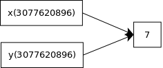

## 2. Basics
### 2.1 Lines
The statement separator in python is the _semi-colon_(__;__).However, it must be used only when writing more than one statement per line.  
The line continuation character is the back-slash (__\__).  
Everything after "#" on a line is treated as comments (is ignored by the interpreter).

### 2.2 Blocks
Python represents block structure using indentation. Other languages uses brackets or _begin/end_ keywords.
This is belived by many to increase the code redability.  
_The indentation level is recommended to be set to 4 spaces and no hard tabs should be used._

### 2.3 Basic built-in types
Python has many built-in types (all of them are presented in the official documentation: https://docs.python.org/3/library/stdtypes.html)  
Here are some basic built-in types.

#### 2.3.1 Numeric types
Python has _integers_, _floats_ and _complex_ numbers.
Python's numeric types are _immutable_. By this we mean that objects of that type are _unmodifiable_.  
For example:

```python
weight = 80           # An integer.
pi = 3.14             # A float.
c = complex(2.5, 3.5) # A complex number (2.5 + j * 3.5).
```
#### 2.3.2 Booleans
A boolean object can be either _True_ or _False_.

#### 2.3.3 Strings
Strings are used to handle _texts_. Strings are sequences of _Unicode code points_.
Strings are also _immutable_.  
There are several ways to specify strings:

```python
s1 = 'Single quoted string'
s2 = "Double quoted string"
s3 = '''Multiline single-quoted string.
This can span on several lines.'''
s4 = """Multiline double-quoted string.
This can span on several lines."""
```
The length of the string can be obtain using the _len_ function:

```python
>>> s = "This is a string"
>>> len(s)
>>> 16
```

Each string can be indexed. The first code point is at _index 0_.
The last one is at index length of string minus one.
The index can also be a negative integer (unlike in many other languages).
In that case, the index is counted starting from the end of the string (-1 is the last code point in the string).  
Indexing a string will result in a string with length 1.

```python
>>> lang = "Python"
>>> lang[0]
>>> 'P'
>>> lang[len(lang) - 1]
>>> 'n'
>>> lang[-1]
>>> 'n'
```

A string can also be _sliced_.
One method of slicing a string is by specifying the start and end indexes (the end index is non-inclusive).
The start or end index can also be omitted.

```python
>>> lang = "Python"
>>> lang[0:1]
>>> 'P'
>>> lang[0:2]
>>> 'Py'
>>> lang[0:-1]
>>> 'Pytho'
>>> lang[0:0]
>>> ''
>>> lang[0:]
'Python'
>>> lang[1:]
'ython'
>>> lang[:]
'Python'
>>> lang[:-1]
'Pytho'
>>> lang[:-2]
'Pyth'
```

A string can also be sliced by specifying an extra paramter: a _stride_.

```python
>>> lang = "Python"
>>> lang[::1]
'Python'
>>> lang[::2]
'Pto'
>>> lang[::3]
'Ph'
```

As mentioned, strings are _immutable_. Trying to modify a string will raise an exception, which is a mechanism usually used to signal an error
condition.

```python
>>> lang = "Python"
>>> lang[0] = "C"
Traceback (most recent call last):
  File "<stdin>", line 1, in <module>
TypeError: 'str' object does not support item assignment
>>> lang = "C" + lang[1:]
>>> lang
'Cython'
```

You can test if a string is a substring in another string by using the _in_ keyword.

```python
>>> "Py" in "Python"
True
>>> "C" in "Python"
False
```

Strings can be concatenated by using the __+__ operator.

```python
>>> s = "Hello" + " Python"
>>> s
'Hello Python'
```

Python has powerful string formatting capabilities:  
```python
>>> "{} {}".format("Hello", "Python")
'Hello Python'
>>> "I am playing {} for {} hours".format("tennis", 2) 
'I am playing tennis for 2 hours'
```

You can explicitly specify the arguments ordering:  
```python 
>>> "{0} {1}".format("Hello", "Python")
'Hello Python'
>>> "{1} {0}".format("Hello", "Python")
'Python Hello'
```

There are a lot of operations that can be done of strings via string _methods_.
A few examples:

```python
>>> lang = "python"
>>> lang.index('h')   # First 'h' is at index 3.
3
>>> lang.capitalize() # Make element at index 0 upper-case.
'Python'
>>> lang.upper()      # Make all elements upper-case.
'PYTHON'
>>> lang = "   python  "
>>> lang
'   python  '
>>> lang.strip()      # Remove all spaces at beggining and end.
'python'
```

Consult the official documentation for more string methods.

#### 2.3.4 Bytes

Bytes (byte strings) objects are _immutable_ sequences of single byte values.
The elements can be specified as _ASCII_ characters or as _hexadecimal digits_.
They presents many similarities with strings. Many constructions which applies to strings also applies to byte strings.

```python
>>> s1 = b"Hello" + b" world"
>>> s1
b'Hello world'
>>> s1[0] = 'C'
Traceback (most recent call last):
  File "<stdin>", line 1, in <module>
TypeError: 'bytes' object does not support item assignment
>>> s2 = b"\x48\x65\x6c\x6c\x6f\x20\x77\x6f\x72\x6c\x64"
>>> s2
b'Hello world'
>>> len(s2)
11
>>> s2[0:5]
b'Hello'
>>> s2.upper()
b'HELLO WORLD'
```

Here, the _s2_ byte array is initialized with the ASCII code values for "Hello world", in hexadecimal.  

Strings can be _encoded_ into byte strings, using some specified _encodings_.  
Ones of the most used encodings are _UTF-8_ and _ASCII_. Similary, byte strings can be _decoded_ into strings.  

```python
>>> "Hello world".encode(encoding='UTF-8')
b'Hello world'
>>> b"Hello world".decode(encoding='UTF-8')
'Hello world'
```

#### 2.3.5 Byte arrays
_bytearray_ objects are _mutable_ sequences of single byte values.  

```python
>>> b = bytearray(b"Python")
>>> b
bytearray(b'Python')
```

Because byte arrays are mutable, we can modify their content. For example, we can modify any byte in the byte array.  

```python
>>> b = bytearray(b"Python")
>>> b[0] = ord(b'C')                      # Change the first element from 'P' to 'C'.
>>> b
bytearray(b'Cython')
>>> b.append(ord(b'x'))                   # Append 'x'.
>>> b
bytearray(b'Cythonx')
>>> b.insert(1, ord(b'z'))                # Insert 'z' at index 1.
>>> b
bytearray(b'Czythonx')
>>> b.hex()
'437a7974686f6e78'                       # Hexadecimal representation for our byte array.
>>> bytes.fromhex('437a7974686f6e78')    # Create a bytearray object from a hexadecimal representation.
b'Czythonx'
```

#### 2.3.6 NoneType

_NoneType_ is a type that has only one value, _None_. _None_ is frequently used to indicate _the absence of a value_.
This is conceptually similar to a _null_ reference in _Java_.

### 2.4 Variables
A variable is a name (a tag) associated (bound) to an _object_. We say that the variable _refer_ the object.  
The object has a specific type. The variable does _not_ have a type.  
During the execution of a program, the same variable can be reassigned to objects of various types.  
Each object has an _unique identifier_ (this unique identifier is actually the object address in memory).  
A variable which refer an object contains the object's unique identifier.  
We can find out the unique identifier of a referred object using the _id()_ function.  

For example:  

```python
>>> x = 7
>>> id(x)
3077620896
>>> y = x
>>> id(y)
3077620896
```

We can see that _x_ and _y_ contain the same unique identifier. This is because _both variables refer to the same object_.
Of course, when running the examples on your computer you will most likely obtain other values for unique identifiers.    
This can be visualized as follows:  



Let's increment the variable _x_:  

```python
>>> x = x + 1
>>> x
8
>>> id(x)
3077620918
```

In this case, after the increment, _a new integer object was created_, having the value equal to 8.  
The _x_ variable was _reassigned_ to the newly created object. That is, after the increment, the _x_ variable refer to the newly created object.  

Let us see what might happen when two variables refer to the same _mutable_ object.  
We will use a slightly modified example from the _Byte arrays_ section:  

```python
>>> b1 = bytearray(b"Python")
>>> b1
bytearray(b'Python')
>>> b1[0] = ord(b'C')
>>> b1
bytearray(b'Cython')
```
Here, the variable _b1_ refer a (mutable) _bytearray_ object. We modify the referred object through the _b1_ variable.  
Let's see what happens when we have two variables that refer the same mutable object and we modify that object.  

```python
>>> b2 = b1
>>> b2
bytearray(b'Cython')
>>> b1[0] = ord(b'X')
>>> b1
bytearray(b'Xython')
>>> b2
bytearray(b'Xython')
```

We have modified that object through the _b1_ variable.  
But, because both _b1_ and _b2_ refer to the same object, we can see the changes also when we access the object using the _b2_ variable.
If we don't want this to happen, we need to create a _copy_ of the object, so that the two variable to refer two different objects.  
We will see how this can be achieved when we will discuss about _lists_.
