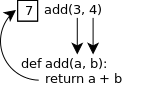

## 4. Functions, closures and lambdas  
### 4.1 Introduction
Until now we only _used_ existing functions (either built-in functions or functions from the standard library).  
In this chapter we will learn how we can create our own functions.  
Non-trivial programs can use functions for reasons such as modularity, code reuse and maintainability.  
These desiderates are extremely important in software development.  
In python, functions are defined using the _def_ keyword.  
Functions have a _name_ and a _body_. They can have _parameters_ (also called _arguments_) and can _return_ values.    
As a first example, this is a simple function which adds two numbers and return their sum.  
```python
>>> def add(a, b):
...     return a + b
... 
>>> add(3, 4)
7
```
Let us identify each component:
- the _name_ of the function is _add_
- the function have two _parameters_, named _a_ and _b_
- the _body_ of the function contains the _statements_ which gets executed when the function is _called_.  
  In our case, the _body_ of the function is: _return a + b_
- the function _returns_ the sum of _a_ and _b_ using the _return_ statement.  

Next, we _call_ our function by passing the numbers _3_ and _4_ as _arguments_.  
Inside the function, _a_ will be a _variable_ which refers the integer value  _3_.  
Similary, _b_ will be a _variable_ referring the integer value _4_.  
After calling the function, the integer value _7_ is returned, as expected.  
This can be visualized as follows:  



The order and number of arguments passed to a function must match those given when defining the function.  
If this is not the case, a _TypeError_ exception is raised.  
```python
>>> add(3)
Traceback (most recent call last):
  File "<stdin>", line 1, in <module>
TypeError: add() missing 1 required positional argument: 'b'
```
It is not mandatory for a function to have parameters or to formally return something.  
For example:
```python
>>> def greet():
...     print("Hello")
... 
>>> greet()
Hello
```
Here, the function _greet()_ does not have any parameters and does not formally return anything.  
Technically, a function which doesn't formally return something will return _None_.

Function parameters can have _default values_. For example:
```python
>>> def compute(a=2, b=3):
...     return 2 * a + b
... 
>>> compute()
7
>>> compute(5)
13
```

We can explicitly name each function parameter:  

```python
>>> compute(b=5)
9
>>> compute(b=5, a=7)
19
>>> compute(a=5, b=7)
17
```

We can define variables in the _scope_ of a function (at function level).  
For example, this is a function which returns the sum of all elements of a sequence:    

```python
>>> def sum(sequence):
...     total = 0
...     for item in sequence:
...         total += item
...     return total
... 
>>> sum([1, 2, 3])
6
```
In this example, _total_ is a variable defined _in the scope_ of the function _sum()_.

In the example above, the statement:
```python
total += item
```
is equivalent to:
```python
total = total + item
```

### 4.2 Variable number of parameters
A function can accept a variable number of parameters if the last parameter is prefixed with an asterisk(*).  
Let us rewrite the _sum()_ function so that we use variable number of parameters:  

```python
>>> def sum(*sequence):
...     total = 0
...     for item in sequence:
...         total += item
...     return total
... 
>>> sum(1, 2, 3)
6
```
The difference between this version and the previous version is that now we don't pass a list or tuple, but we pass directly a variable number of arguments.  
If we try to pass a list, as before, we get an exception:

```python
>>> sum([1, 2, 3])
Traceback (most recent call last):
  File "<stdin>", line 1, in <module>
  File "<stdin>", line 4, in sum
TypeError: unsupported operand type(s) for +=: 'int' and 'list'

If we want to achieve this, we need to _unpack_ the list:

```python
>>> sum(*[1, 2, 3])
6
```

If the last argument of a function begins with **, all the additional keyword arguments are placed in a dictionary:  

```python
>>> def generic_function(*args, **kwargs):
...     print("Arguments:")
...     for arg in args:
...         print(arg, end=' ')
...     print("\nKeyword arguments:")
...     for key, val in kwargs.items():
...         print("{}:{}".format(key, val))
... 
>>> generic_function(1, 2, 3, one=1, two=2, three=3)
Arguments:
1 2 3 
Keyword arguments:
one:1
two:2
three:3
```

### 4.3 More about arguments passing
When a function is called, its arguments are variables which refer to the passed input objects.  
This implies that if a passed input object is _mutable_, the function can modify (mutate) that object.  
Here is an example:  

```python
>>> def sequence_append(sequence, item):
...     sequence.append(item)
... 
>>> items = [1, 2, 3]
>>> items
[1, 2, 3]
>>> sequence_append(items, 4)
>>> items
[1, 2, 3, 4]
```

This is happening because there are two variables that points to the same list objects: _items_ and _sequence_.  
We than modified the referred object inside the *sequence_append()* function via the _sequence_ parameter.
If a input object is immutable, it cannot be modified inside a function (or at all).  

```python
>>> def increment_number(num):
...    num += 1
...    print("Inside the function, num = {}".format(num))
... 
>>> a = 3
>>> a
3
>>> increment_number(a)
Inside the function, num = 4
>>> a
3
>>> 
```

As we can see, the function did not modified the input argument (variable _a_ remained unchanged).
This is because integers are immutable objects and after the following statement:
```python
num + =1
```
_num_ variable started to refer another (local) object than variable _a_. 

### 4.4 Namespaces and variables scoping
Every time a function executes, a _local namespace_ is created. This is sometimes also referred as a _frame_. 
When the function finishes its execution, the associated local namespace is destroyed.  
This local namespace represents an environment that contains the function parameters and the variables defined inside the function body.  
Both function parameters and variables defined inside the function body act, from the scoping point of view, as variables _local_ to the function.  
Local variables are variables _bound_ to the local namespace associated to the function.  
Besides the _local namespace_, we also have the _global namespace_ and the _builtin namespace_.  
To access the _local namespace_, one can use the _locals()_ function:

```python
>>> def foo():
...     x, y, z = 1, 2, 3
...     print(locals())
...
>>> foo()
{'z': 3, 'y': 2, 'x': 1}
```

To access the global namespace, one can use the _globals()_ function.  
The _builtin namespace_ can be accessed as follows:

```python
>>> print(dir(__builtins__))
```

The _local namespace_ and the _global namespace_ are implemented as _dictionaries_. The _builtin namespace_ is a _module_.

Variable scoping refers to the _visibility rules_ of a variable.  

In a nutshell, the (simplified) scoping rules are:  
1. When the Python interpreter needs to evaluate the value of a variable, it searches it first in the local namespace.  
2. If no match exists, it searches it in the global namespace. The global namespace of a function is the _module_ in which the function is executed.  
3. If still no match exists, it searches in the built-in namespace (the namespace which contains the built-n objects).  
4. If still no match exists, a _NameError_ exception is raised.  

_One of the first thing which needs to be understood is that variables bound to different namespaces are different variables even if they have the same name_.  

Here are some examples:

```python
>>> a = 3 # bound to the global namespace.
>>> b = 4 # bound to the global namespace.
>>> def add(a, b):
...     # a and b are bound to the local namespace.
...     return a + b
... 
>>> add(a, b)
7
```

When the function _add()_ starts executing, a local namespace associated to the function is created.  
At this point, we will have two variables named _a_: one bound to the global namespace and one bound to the local namespace of the _add()_ function.  
By the mechanics of parameters passing, both variables called _a_ will refer to the same integer object, having value _3_.  
Similary, we will have two variables called _b_ which will refer the same integer object having value _4_.  

Let us look at another example:  

```python
>>> a = 5
>>> def foo():
...     a = 6
... 
>>> foo()
>>> a
5
```

Here, because whe assign the variable _a_ inside the function, _a new local variable was created_.  
Yes, _incidentally_ has the same name as the variable _a_ bound to the global namespace, but it is actually a _different_ variable bound to the local namespace associated to the _foo()_ function.  
If we really want to modify the variable named _a_ which is bound to the global namespace, we need to use the _global_ statement.  

```python
>>> a = 5
>>> def foo():
...     global a
...     a = 6
... 
>>> foo()
>>> a
6
```
Here, by using the _global_ statement, we specify that _a_ is a variable already bound to the global namespace.  
Now, let us try to write a function which displays the value of a variable bound to the global namespace.  

```python
>>> def display():
...     print(a)
... 
>>> a = 5
>>> display()
5
```

We can see that we managed to display the value of the variable _a_, bound to the global namespace, without the need of the _global_ statement.  
This was possible because of the scoping rule 2: the Python interpreter didn't found any variable named _a_ bound to the local namespace, so it searched the global namespace.  
A variable named _a_ was found in the global namespace and therefore was used.  

Let us try another example:

```python
>>> def display():
...     print(x)
... 
>>> display()
Traceback (most recent call last):
  File "<stdin>", line 1, in <module>
  File "<stdin>", line 2, in display
NameError: name 'x' is not defined
```

In this case, we got a _NameError_ exception, as expected per scoping rule 4. The is no variable named b bound to the either local, global, or built-in namespace.  

If we try to use a local variable before it is assigned with a value, an _UnboundLocalError_ exception is raised:  

```python
>>> i = 0
>>> def increment():
...     i += 1
... 
>>> increment()
Traceback (most recent call last):
  File "<stdin>", line 1, in <module>
  File "<stdin>", line 2, in increment
UnboundLocalError: local variable 'i' referenced before assignment
```

Here, inside the _increment()_ function, the variable i is assigned and the _global_ statement is not used. This makes it a local variable.  
But the statement i += 1 tries to read the value of i which was not yet assigned, hence the error.  

### 4.5 About default values again
We have seen in section 4.1 that a function can have parameters with default values.  
It is allowed that the default values to be both mutable and immutable objects. 
But, as a best-practice advice, you _should really prefer immutable objects_.  
Here is an example to see why:

```python
>>> def add_one(list=[]):
...     print('Before add: ', list)
...     list.append(1)
...     print('After add: ', list)
...
>>> add_one()
Before add:  []
After add:  [1]
>>>
>>> add_one()
Before add:  [1]
After add:  [1, 1]
>>>
```

Here, we define a function named _add_one_, which appends the value 1 to a list sent as parameter. 
The list argument has a _default value equal to an empty list_. 
This means that we can call the function _without passing any parameter_, and, in this case, _an empty list is used_.
In the function, we print the conten of the list parameter before and after we append the value to it. 
After we call the function first time, we can see that the list parameter was empty before appending to it. 
After the append, we can see that the list contains en element equal to 1, as expected.  
So far, nothing out of the ordinary. But let us call the function again. 
This time, we see that the list parameter already contains one element (equal to 1), before appending to it !  
So, the function has a _side effect_ that might surprise many programmers unfamiliarized with this behavior.  
What is happening ? The problem is that the parameter having a default value is _evaluated only once_. 
If you modify it (assuming it is mutable, like in our example), you will see the modification across function calls.  
How can we prevent this ? The _pythonic_ solution is as follows:

```python
>>> def add_one(list=None):
...     if list is None:
...         list = []
...     print('Before add: ', list)
...     list.append(1)
...     print('After add: ', list)
...
>>> add_one()
Before add:  []
After add:  [1]
>>>
>>> add_one()
Before add:  []
After add:  [1]
>>>
>>> my_list = []
>>>
>>> add_one(my_list)
Before add:  []
After add:  [1]
>>> my_list
[1]
>>>
>>> add_one(my_list)
Before add:  [1]
After add:  [1, 1]
>>> my_list
[1, 1]
>>>
```

Here, we can see that the problem described before is solved and that also our function works as espected when we pass a given list as parameter.  
So, don't pass mutable objects as default parameter values (such as lists, dictionaries, bytearrays, etc). Use _None_ as the default value, in that cases.

### 4.6 Functions are objects
Let us remember that everything in Python is an object. That means that _functions are objects too_.  
People with a computer science background may recall the _"functions are values"_ principle from the functional programming paradigm.  
While Python is not technically a functional programming language, it has some functional programming capabilities.  
Because functions are objects, we can, for example, assign a function to a variable:

```python
>>> def max(a, b):
...    if a > b:
...        return a
...    return b
...
>>> max(2, 3)
3
>>> max_func = max
>>> max_func(9, 3)
9
```

Here, *max_func* is a variable which refers an object which happens to be a function. We can call the function also via *max_func*.  

In fact, functions are _callable_ objects. See the below example:

```python
>>> var = 5
>>> callable(var)
False
>>> callable(max)
True
>>> callable(max_func)
True
>>>
```

### 4.7 Documentation strings (docstrings)
It is very common for a function to begin with a documentation string describing its usage.  
It is not mandatory to always have a docstring, but it is considered good practice to have one for functions with an immediate obvious purpose.  
For example, let us rewrite the _max_ function, but this time using a _docstring_.

```python
>>> def max(a, b):
...     """Return the maximum of two numbers"""
...     if a > b:
...         return a
...     return b
... 
```

Functions being objects, we can access some of their attributes.  
For example, we can programatically access the function name and docstring attributes:    

```python
>>> max.__name__
'max'
>>> max.__doc__
'Return the maximum of two numbers'
```

### 4.8 Nested functions and closures
Python supports nested function definitions (meaning functions defined inside other functions).  
Here is an example:  

```python
>>> def make_greeter(name):
...     def greeter():
...         print("Hello {}".format(name))
...     return greeter
... 
>>> greet_john = make_greeter("John")
>>> greet_john()
Hello John
>>>
>>> greet_mike = make_greeter("Mike")
>>> greet_mike()
Hello Mike
```

In section 4.6 we have seen that functions are objects.  
So, if functions are objects, it means that a function can receive as parameter another function or it can return a function.  
Returning to our example, we notice that the *make_greeter()* function _returns another function_ (the _greeter()_ function).  
The _greeter()_ function is a _nested function_, because it is defined inside the *make_greeter()* function.   
The *make_greeter()* function is the _enclosing function_ of the _greeter()_ function.  

Another thing we notice is the fact that the _greeter()_ function accesses the _name_ parameter of its enclosing function.  
Because the _name_ parameter is referenced by the _greeter()_ function, its referred object is kept alive after the *make_greeter()* function has finished.  
This makes the _greeter()_ function not only nested function, but also a _closure_. Closures _captures_ the environment needed by their execution.  

Let us try another example:

```python
>>> def outer_function():
...     msg = 'Outer'
...     def inner_function():
...         msg = 'Inner'
...         print('In inner function, msg is', msg)
...     print('In outer function, msg is', msg)
...     inner_function()
...     print('In outer function again, msg is', msg)
...
>>> outer_function()
In outer function, msg is Outer
In inner function, msg is Inner
In outer function again, msg is Outer
```

Here, we have a function, called *outer_function*, which has a local variable called _msg_.  
In this function we have a nested function, which also have a local variable called _msg_.  
So, we have two **different** variables with the same name (_msg_), in two scopes: an outer scope (bound to the *outer_function*) and an inner scope (bound to the *inner_function*).  
But what if we want to change the value of the msg variable bound to the outer scope, from the _inner_function_ ? Can we use the _global_ keyword ?  
Let's try:

```python
>>> def outer_function():
...     msg = 'Outer'
...     def inner_function():
...         global msg
...         msg = 'Inner'
...         print('In inner function, msg is', msg)
...     print('In outer function, msg is', msg)
...     inner_function()
...     print('In outer function again, msg is', msg)
...
>>> outer_function()
In outer function, msg is Outer
In inner function, msg is Inner
In outer function again, msg is Outer
```

So, it didn't worked. We failed to modify the value of the _msg_ variable bound to the outer scope.  

What is the solution ? Python 3 introduced the _nonlocal_ keyword that allows to assign a variable in an outer, but non-global, scope.  

```python
>>> def outer_function():
...     msg = 'Outer'
...     def inner_function():
...         nonlocal msg
...         msg = 'Inner'
...         print('In inner function, msg is', msg)
...     print('In outer function, msg is', msg)
...     inner_function()
...     print('In outer function again, msg is', msg)
...
>>> outer_function()
In outer function, msg is Outer
In inner function, msg is Inner
In outer function again, msg is Inner
```

### 4.9 Lambdas. The map, filter and reduce functions.
Lamdas are small, anonymous functions, which are not bound to a name. They are _throw-away_ functions, needed only were have been created.  
For example, here is a function which receives two arguments and returns their sum.

```python
>>> add = lambda x, y: x + y
>>> add(2, 3)
5
```

Here, we have a _lambda_ which receives two arguments (named _x_ and _y_) and returns their sum. 
A _lambda_, is, of course, an object. Here we have a variable named _add_ which refers our lambda object. Than, we call the lambda with parameters 2 and 3.  
Why should we use a lambda ? Because sometimes it makes the code more succint. 
To see this, let's move on to the _map_ function.  
Let us assume that given the list of integers from 1 to 10, we want to create another list containing those integers squared. 
There are, of course, multiple ways to do this.  
The direct way:

```python
>>> values = []
>>> for i in range(1, 11):
...     values.append(i**2)
...
>>> values
[1, 4, 9, 16, 25, 36, 49, 64, 81, 100]
```

But, as we have seen in the previous chapter, a more idiomatic way is to use a _list comprehension_:

```python
>>> values = [i ** 2 for i in range(1, 11)]
>>> values
[1, 4, 9, 16, 25, 36, 49, 64, 81, 100]
``` 

We can also use the _map_ function. The map function receives two arguments: a function which receives an argument and a sequence (e.g a list). 
It applies the function on each element of the sequence and returns a collection which each result.  

```python
>>> def square(x):
...     return x**2
>>> values = list(map(square, range(1, 11)))
>>> values
[1, 4, 9, 16, 25, 36, 49, 64, 81, 100]
```

But, isn't it unconvenient that we need to create a _square_ function just for it ? Let's use a lambda.

```python
>>> values = list(map(lambda x: x**2, range(1, 11)))
>>> values
[1, 4, 9, 16, 25, 36, 49, 64, 81, 100]
```

### 4.10 Rules for functions design, in the real world
- Functions should be short. Long functions increase the code complexity and become harder to follow.
- Functions should do one thing and do it well. If you have multiple tasks to do, you should create more functions.
- Try to minimize the usage of global variables as much as possible. Prefer using function parameters instead.
- Pay attention to the number of parameters. If a function receives more than five parameters, it makes it harder to use without looking at the documentation.
  In that case re-analyse your function design. 
- Functions with a non-obvious immediate purpose should have docstrings attached.
- Functions should have good names: not overly verbose but also not cryptic. The name of the function should directly suggest their purpose.
  Similary, the function parameters and local variables should have appropriate names, suggesting their purpose.
- Use comments inside the functions, if you feel that it really adds value (clarify things). But don't try to document self-obvious code.
