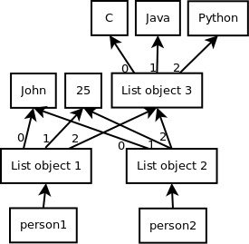
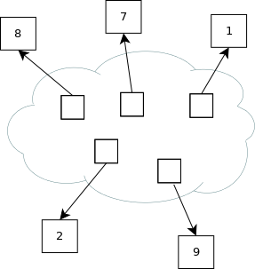

## 4. Lists, tuples, sets and dictionaries
### 4.1 Lists
#### 4.1.1 Lists basics
_Lists_ are _mutable_ sequences of objects having arbitrary types.  
You can create a list by enclosing values in _squared brackets_.  
Another way to create a list is to use the _list()_ function and provide a sequence of elements.  
   
```python
>>> countries = ["France", "Great Britain", "Germany", "United States"]
>>> countries
['France', 'Great Britain', 'Germany', 'United States']
```
Lists can be _indexed_ by integers, starting from _zero_.  
The countries list can be visualized as follows:    
 
  

To find out the length o a list, use the built-in _len_ function.  
```python
>>> countries[0]
'France'
>>> len(countries)
4
>>> countries[0] = "Japan"
>>> countries
['Japan', 'Great Britain', 'Germany', 'United States']
>>> type(countries)
list
```
Lists can also be _sliced_. By slicing a list we obtain another list.  

```python
>>> european_countries = countries[1:3]
>>> european_countries
['Great Britain', 'Germany']
```

An element can be appended to a list by using the _append()_ method.

```python
>>> countries.append("Argentina")
>>> countries
['Japan', 'Great Britain', 'Germany', 'United States', 'Argentina']
>>> len(countries)
5
```

We can also insert elements in a list by using the _insert()_ method.  

```python
>>> countries.insert(3, "Italy")
>>> countries
['Japan', 'Great Britain', 'Germany', 'Italy', 'United States', 'Argentina']
```

We can delete an element in the list using the _del_ statement.  

```python
>>> del countries[4]
>>> countries
['Japan', 'Great Britain', 'Germany', 'Italy', 'Argentina']
```

You can also delete an element by value, using the _remove()_ method.  
For example, to remove the first element equal to 'Great Britain':    

```python
>>> countries.remove('Great Britain')
>>> countries
['Japan', 'Germany', 'Italy', 'Argentina']
```

We can test if an element belongs to a list using the _in_ operator.  

```python
>>> "Germany" in countries
True
>>> "China" in countries
False
```

Lists can be iterated using the _for_ statement.  
The iteration is done in the order in which the elements were added to the list.

```python
>>> for country in countries:
>>>     print(country, end='')
Japan Germany Italy Argentina
```

Lists can be concatenated using the _+_ operator:  

```python
>>> countries += ["Ireland", "Norway"]
>>> countries
['Japan', 'Germany', 'Italy', 'Argentina', 'Ireland', 'Norway']
```

#### 4.1.2 Lists comprehensions
Let's say we want to construct a list with all the even numbers from 1 to 99.  
Of course, we can build it like this:  

```python
>>> numbers = []
>>> for i in range(1, 100):
>>>     if i % 2 == 0:
>>>         numbers.append(i)
```

There is more succint way to accomplish this by using a _list comprehension_:    

```python
>>> numbers = [i for i in range(1, 100) if i % 2 == 0]
```

#### 4.1.3 Copying lists
Let's say we want to create a copy of a list. We might try to proceed like this:  

```python
>>> l1 = [1, 2, 3]
>>> l2 = l1
```

But let's see what happend when we modify the object referred by _l1_:  

```python
>>> l1[0] = 4
>>> l1
[4, 2, 3]
>>> l2
[4, 2, 3]
```

As we have seen when we have discussed about variables, this is because _both l1 and l2 refer to the same object_ and that object was modified.  

This can be visualized as follows:  


If we don't want this to happen, we need to create a _copy_ of the object referred by _l1_.  
There are two types of copies: _shallow_ and _deep_. We can create a _shallow copy_ of _l1_ as follows:  

```python
>>> l1 = [1, 2, 3]
>>> l2 = l1[:]     # Or l2 = list(l1), or l2 = l1.copy()
>>> l1[0] = 4
>>> l1
[4, 2, 3]
>>> l2
[1, 2, 3]
```

So, we can see that, in this case, there was no problem because _l1_ and _l2_ refer two different objects.  
To see the difference between a _shallow_ and a _deep copy_, let's consider another example.

```python
>>> person1 = ["John", 25, ["C", "Java"]]
>>> person2 = person1[:]
>>> person1[1] = 30
>>> person1
['John', 30, ['C', 'Java']]
>>> person2
['John', 25, ['C', 'Java']]
>>> person1[2].append("Python")
>>> person1
['John', 25, ['C', 'Java', 'Python']]
>>> person2
['John', 25, ['C', 'Java', 'Python']]
```

This can be visualized as follows:  



The explanation, in this case, is that even if _person2_ is a shallow copy of _person1_, both _person1[2]_ and _person2[2]_ refer the same object.  
If we really want to create a deep copy, we can use the _deepcopy()_ function from the standard library _copy_ module.  

```python
>>> from copy import deepcopy
>>> person1 = ["John", 25, ["C", "Java"]]
>>> person2 = deepcopy(person1)
>>> person1
['John', 25, ['C', 'Java']]
>>> person2
['John', 25, ['C', 'Java']]
>>> person1[2].append("Python")
>>> person1
['John', 25, ['C', 'Java', 'Python']]
>>> person2
['John', 25, ['C', 'Java']]
```

We can see that this time, the copy remained unchanged after the original has changed.

### 4.2 Tuples
_Tuples_ are _immutable_ sequences of objects having arbitrary types.  
They share a lot of similarities with lists, but, unlike lists, are immutable.  
Because tuples are immutable they use a more compact representation and allocates less memory than lists. 
Tuples can be created by enclosing a group of values in paranthesis.  
Another way to create a tuple is to use the _tuple()_ function and provide a sequence of elements.  

```python
>>> person1 = ("John", 30, 726998343)
>>> person1
('John', 30, 726998343)
>>> len(person1)
3
>>> person1_name = ("John",)           # One element tuple.
>>> person1_name
('John',)
>>> name = ("John")                    # A string, not a tuple.
>>> name
'John'
>>> "John" in person1
True
>>> "Alex" in person1
False
```

Like lists, tuples can be indexed by integers, sliced and concatenated.
Unlike lists, they do not support comprehensions (there is no tuple comprehension)

```python
>>> person1[0]
'John'
>>> person1[1]
30
>>> person1[2]
726998343
>>> person1[1:]
(30, 726998343)
>>> person2 = ("Mike", 25, 726339362)
>>> person2
('Mike', 25, 726339362)
>>> persons = person1 + person2
>>> persons
('John', 30, 726998343, 'Mike', 25, 726339362)
>>> len(persons)
6
```

Tuples can be iterated using the _for_ statement.  

```python
>>> all_persons = (person1, person2)
>>> all_persons
(('John', 30, 726998343), ('Mike', 25, 726339362))
>>> len(all_persons)
2
>>> for name, age, telephone in all_persons:
>>>     print("name:", name)
>>>     print("age:", age)
>>>     print("tel:", telephone)
name: John
age: 30
tel: 726998343
name: Mike
age: 25
tel: 726339362
>>> ('Mike', 25, 726339362) in all_persons
True
>>> ('Jack', 25, 726339362) in all_persons
False
```

Tuples are immutable. Trying to modify a tuple will raise a _TypeError_ exception.

```python
>>> person1[0] = "Michael"
TypeError                                 Traceback (most recent call last)
<ipython-input-21-6b8f99475328> in <module>()
----> 1 person1[0] = "Michael"

TypeError: 'tuple' object does not support item assignment
```

### 4.3 Sets
_Sets_ are _mutable_ _unordered_ collection of _unique_ objects. A set _cannot contain duplicates_.  
Sets can be created by enclosing a group of values in curly braces.  
Another way to create a set is to use the _set()_ function and provide a sequence of elements.  
To create an _emtpy_ set, use the _set()_ function without any parameter.   

```python
>>> empty_set = set()
>>> empty_set
set()
>>> len(empty_set)
0
>>> s = {9, 8, 1, 2, 1, 9, 8, 7}
>>> s
{1, 2, 7, 8, 9}                  # Note that the duplicates were removed.
>>> len(s)
5
```

This set can be visualized as follows:  



As you can see, the elements in the set were not stored in a specific order.  
Unlike strings, lists and tuples, sets _cannot be indexed by integers_.  
Trying to do this will raise a _TypeError_ exception.  

```python
>>> s[0]
TypeError                                 Traceback (most recent call last)
<ipython-input-14-4e98c4f87897> in <module>()
----> 1 s[0]

TypeError: 'set' object does not support indexing
```
The elements of a set are also called _keys_.  
Set elements need to be _hashable_ objects. This means that, given a set element, we can compute a _hash value_ which never changes for the duration of the object life.   
For those who want to learn more about hashing, read this wikipedia page: https://en.wikipedia.org/wiki/Hash_table  
This means, for example, that we can add objects like integers, bytes, strings in a set. But we cannot add objects as bytearrays or lists, since there are not hashable.  
Let us see what happens if we try to create a set containing unhashable objects.  

```python
>>> my_list = [1, 2]
>>> broken_set = {my_list}
TypeError                                 Traceback (most recent call last)
<ipython-input-5-97a279f858c0> in <module>()
----> 1 broken_set = {my_list}

TypeError: unhashable type: 'list'
```

As you can see, an exception was raised.  

You can add a new element in a set using the _add()_ method. 

```python
>>> s.add(99)
>>> s
{1, 2, 7, 8, 9, 99}
```

You can add multiple elements at once using the _update()_ method (pass a sequence of objects as parameter).  

```python
>>> s.update((100, 101))
>>> s
{1, 2, 7, 8, 9, 99, 100, 101}
```

An element can be removed using the _remove()_ method.  

```python
>>> s.remove(8)
>>> s
{1, 2, 7, 9, 99, 100, 101}
```

You can check if an object belongs to a set as usual, by using the _in_ operator.  

```python
>>> 99 in s
True
>>> 70 in s
False
```

You can iterate over a set using the _for_ statement.  
The iteraton is _not_ done in the order of insertion.  

```python
>>> for i in s:
>>>     print(i, end=' ')
1 2 99 100 101 7 9
```

Sets also supports _union_,  _intersection_ and _difference_ operations.  

```python
>>> s1 = {1, 2, 3, 4}
>>> s2 = {3, 4, 5, 6}
>>> s1 | s2            # Union (items in s1 or in s2)
{1, 2, 3, 4, 5, 6}
>>> s1 & s2            # Intersection (items both in s1 and in s2)
{3, 4}
>>> s1 - s2            # Difference (items in s1 but not in s2)
{1, 2}
>>> s2 - s1            # Difference (items in s2 but not in s1)
{5, 6}
>>> s1 ^ s2            # Symmetric difference (items in s1 or in s2, but not in both)
{1, 2, 5, 6}
```

Sets also supports _comprehension_.  

```python
>>> even = {i for i in range(1, 10) if i % 2 == 0}
>>> even
{2, 4, 6, 8}
```

This is equivalent to:  

```python
>>> even = set()
>>> for i in range(1, 10):
>>>     if i % 2 == 0:
>>>         even.add(i)
>>> even
{2, 4, 6, 8}
```

The content of a set can be cleared using the _clear()_ function.  

```python
>>> s = {1, 2, 3}
>>> s
{1, 2, 3}
>>> s.clear()
>>> s
set()
```

### 4.4 Frozen sets
_Frozen sets_ are _immutable_ sets. They are sets that cannot be modified.  
That is, we cannot add more elements to a frozen set once it is created. Nor can we remove elements from it.  
An example:  

```python
>>> countries = frozenset(("Germany", "Italy", "France"))
>>> countries
frozenset({'France', 'Germany', 'Italy'})
>>> "France" in countries
True
>>> "Argentina" in countries
False
>>> for country in countries:
>>>     print(country, end=' ')
France Italy Germany
>>> countries.add("Argentina")
AttributeError                            Traceback (most recent call last)
<ipython-input-11-836183644535> in <module>()
----> 1 countries.add("Argentina")

AttributeError: 'frozenset' object has no attribute 'add'
```

### 4.5 Dictionaries
_Dictionaries_ are associative arrays, mapping keys to values.  
The keys needs to be _hashable_ objects.  
Dictionaries can be created by enclosing the values inside curly braces, as follows:  

```python
>>> empty_dict = {}
>>> len(empty_dict)
0
>>> capitals = {"United Kingdom" : "London", "France" : "Paris", "Italy" : "Rome", "Germany" : "Berlin"}
>>> capitals
{'France': 'Paris',
 'Germany': 'Berlin',
 'Italy': 'Rome',
 'United Kingdom': 'London'}
>>> capitals["France"]  # "France" is a key in the dictionary. "Paris" is its value.
'Paris'
>>> len(capitals)
4
```

Not that the key-value pairs are not displayed in the order they were entered.  
Dictionaries are _unrodered_ objects.

If the key is not present in a dictionary, a _KeyError_ exception is raised:  

```python
>>> capitals["Norway"]
KeyError                                  Traceback (most recent call last)
<ipython-input-15-7127c6ffa0ad> in <module>()
----> 1 capitals["Norway"]

KeyError: 'Norway'
```

If you don't want to obtain an exception when trying to access the value of a non-existent key, use the _get()_ method:  

```python
>>> capitals.get("France", "Unknown")
'Paris'
>>> capitals.get("Norway", "Unknown")
'Unknown'
```

The second parameter passed to the _get()_ method is the value to be returned when the key is _not_ present in the dictionary.  

The keys in a dictionary must be _imutable_ objects.  
Dictionaries are mutable objects. We can modify the value associated to a certain key.  

```python
>>> capitals["France"] = "paris"
>>> capitals["France"]
'paris'
>>> capitals["France"] = "Paris"
```

You can add more _key-value_ pairs in a dictionary:  

```python
>>> capitals["Spain"] = "Madrid"
>>> capitals
{'France': 'Paris',
 'Germany': 'Berlin',
 'Italy': 'Rome',
 'Spain': 'Madrid',
 'United Kingdom': 'London'}
```

You can test if a key is present in a dictionary using _in_:  

```python
>>> "France" in capitals
True
>>> "Sweden" in capitals
False
```

You can remove a _key-value_ pair from a dictionary using _del_:  

```python
>>> del capitals["Spain"]
>>> capitals
{'France': 'Paris',
 'Germany': 'Berlin',
 'Italy': 'Rome',
 'United Kingdom': 'London'}
```

You can iterate over the _keys_ in a dictionary as follows:  

```python
>>> for country in capitals:
>>>     print("{}-{}".format(country, capitals[country]), end=' ')
France-Paris Germany-Berlin Italy-Rome United Kingdom-London
```

This is the same as:  

```python
>>> for country in capitals.keys():
>>>     print("{}-{}".format(country, capitals[country]), end=' ')
France-Paris Germany-Berlin Italy-Rome United Kingdom-London
```

You can iterate over the _values_ in a dictionary as follows:  

```python
>>> for capital in capitals.values():
>>>     print(capital, end=' ')
Paris Berlin Rome London
```

You can iterate over the _key-value pairs_ in a dictionary as follows:

```python
>>> for country, capital in capitals.items():
>>>     print("{}->{}".format(country, capital), end=' ')
France-Paris Germany-Berlin Italy-Rome United Kingdom-London
```

A dictionary can be constructed from two sequences using the _zip()_ function.  
The first sequence contains the keys and the second the values.  

```python
>>> asian_capitals = dict(zip(("China", "Japan"), ("Beijing", "Tokyo")))
>>> asian_capitals
{'China': 'Beijing', 'Japan': 'Tokyo'}
```

The same thing could have been accomplished by using a _dictionary comprehension_: 

```python
>>> asian_capitals = {country: capital for (country, capital) in zip(("China", "Japan"), ("Beijing", "Tokyo"))}
>>> asian_capitals
{'China': 'Beijing', 'Japan': 'Tokyo'}
```

A dictionary can also be merged with the content of another dictionary using the _update()_ method:  

```python
>>> capitals.update(asian_capitals)
>>> capitals
{'China': 'Beijing',
 'France': 'Paris',
 'Germany': 'Berlin',
 'Italy': 'Rome',
 'Japan': 'Tokyo',
 'United Kingdom': 'London'}
```

The content of a dictionary can be cleared by using the _clear()_ method:  

```python
>>> capitals.clear()
>>> capitals
{}
```
